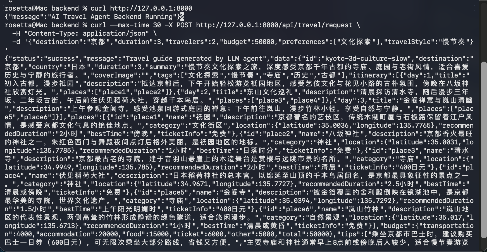
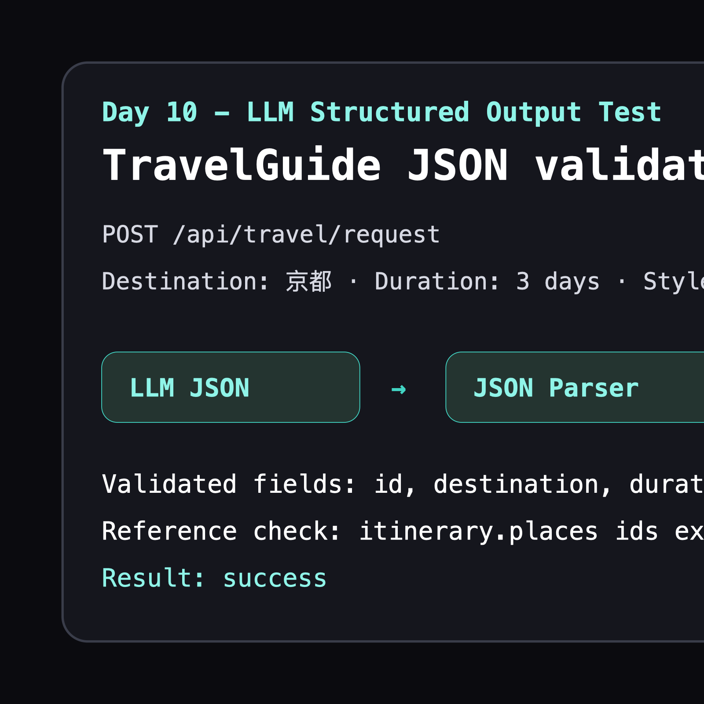

# 开发日志

## Day 1

## 日期：

2026-07-10

## 今日目标：

初始化前端工程。

## 完成内容：

- 创建 Next.js 前端项目
- 配置 TypeScript
- 配置 Tailwind CSS
- 完成实机运行测试并记录页面截图

## 新增文件：

- frontend/

## 学习知识：

- Next.js
- React
- TypeScript
- 前后端分离

## 技术理解：

前端应该独立于 Agent 后端，因为它们承担的职责不同。

前端负责用户界面、交互体验和结果展示。用户输入旅行需求、查看旅游攻略、浏览每日行程、点击地图地标，这些都属于前端关注的问题。

Agent 后端负责需求理解、任务规划、工具调用、信息整理和结构化输出。它更关注数据如何被生成、处理和返回。

把前端和 Agent 后端分开，可以让前端先使用模拟数据开发页面，也可以让后端独立演进 Agent 工作流。未来二者通过 API 连接，数据从后端流向前端，前端负责把数据清晰地展示给用户。

## 实机测试结果：

本地运行前端开发服务器后，浏览器可以正常打开初始化页面。

测试页面显示当前阶段为 `Stage 1 - Frontend Initialization`，说明 Next.js 前端工程已经可以正常启动并渲染基础页面。


## 遇到问题：

- 首次运行 Next.js 初始化命令时，沙盒环境无法访问 npm registry。
- 首次运行 `npm run build` 时，Next.js 16 的 Turbopack 在沙盒内创建进程和绑定端口被系统拦截。
- npm 安装完成后提示依赖审计中存在 2 个中等级别问题，本次未使用可能破坏依赖版本的自动修复命令。

## 解决方案：

- 使用授权方式重新运行官方初始化命令，完成前端工程创建。
- 使用授权方式重新运行 `npm run build`，生产构建通过。
- 暂不运行 `npm audit fix --force`，后续可以单独安排依赖安全维护任务。

## Git Commit:

feat: initialize frontend application

## 明日计划：

创建旅游攻略数据模型。

## Day 2

## 日期：

2026-07-10

## 今日目标：

设计旅游攻略数据模型。

## 完成内容：

- 创建 TypeScript Interface
- 创建 Sample JSON
- 创建数据结构文档

## 新增文件：

- frontend/src/types/travel.ts
- frontend/src/data/sample-guide.json
- docs/DATA_SCHEMA.md

## 学习知识：

- Schema
- Interface
- Structured Output
- 数据驱动开发

## 技术理解：

Agent 应该输出结构化数据，而不是只输出一段自由文本。

自由文本适合人阅读，但不适合程序稳定处理。旅游攻略未来需要被前端拆分成页面标题、每日行程、景点卡片、地图坐标、预算信息和导出内容。如果 Agent 只输出 Markdown，前端很难稳定判断每一段文字的真实含义。

结构化数据可以让 Agent 的输出进入后续工程流程：Backend 可以校验 JSON 是否符合 Schema，Frontend 可以按字段渲染页面，地图可以读取经纬度生成 Marker，导出功能也可以复用同一份数据。

## 遇到问题：

无

## 解决方案：

无

## Git Commit:

feat: define travel guide data schema

## 下一阶段：

实现基于 Mock 数据的旅游攻略页面。

## Day 3

## 日期：

2026-07-10

## 今日目标：

实现旅游攻略展示页面。

## 完成内容：

- 创建 React 组件
- 使用 JSON 数据驱动页面
- 完成旅游攻略原型
- 使用本地开发服务器验证页面渲染

## 新增文件：

- frontend/src/components/travel/TravelHeader.tsx
- frontend/src/components/travel/DayTimeline.tsx
- frontend/src/components/travel/PlaceCard.tsx
- frontend/src/components/travel/BudgetCard.tsx
- frontend/src/components/travel/TravelTips.tsx

## 修改文件：

- frontend/src/app/page.tsx
- DEVELOPMENT_LOG.md
- LEARNING_NOTES.md

## 学习知识：

- React Component
- Props
- 数据驱动 UI
- 组件拆分

## 技术理解：

未来 Agent 只需要生成符合 `TravelGuide` 结构的 JSON，前端就可以自动展示页面。

原因是页面组件并不关心数据来自哪里，只关心收到的数据结构是否稳定。`page.tsx` 读取 `sample-guide.json` 后，把目的地信息传给 `TravelHeader`，把每日行程传给 `DayTimeline`，把景点传给 `PlaceCard`，把预算传给 `BudgetCard`，把建议传给 `TravelTips`。

当未来接入 Agent 后，只要 Agent 输出同样结构的 `TravelGuide JSON`，前端组件就可以复用，不需要为每个目的地重新写页面。

## 测试结果：

- `npm run lint` 通过。
- `npm run dev` 启动后，`localhost:3000` 可以展示京都标题、三天行程、景点卡片、预算估算和旅行建议。
- `npm run build` 在授权环境下通过，生产构建成功。

实机测试截图：


## 遇到问题：

- 首次在沙盒内运行 `npm run dev` 时，Next.js 无法绑定 `0.0.0.0:3000`，出现 `listen EPERM`。
- 首次在沙盒内运行 `npm run build` 时，Next.js 16 的 Turbopack 创建进程和绑定端口被拦截。

## 解决方案：

- 使用授权方式重新运行 `npm run dev`，开发服务器成功启动，并完成本地页面验证。
- 使用授权方式重新运行 `npm run build`，生产构建通过。

## Git Commit:

feat: build travel guide prototype page

## 下一阶段：

完善页面交互。

## Day 4

## 日期：

2026-07-10

## 今日目标：

优化旅游攻略页面 UI。

## 完成内容：

- 优化页面布局
- 完善组件样式
- 增加响应式设计
- 生成 Day 4 UI 预览图

## 新增文件：

- docs/images/day-4-ui-preview.png

## 修改文件：

- frontend/src/app/page.tsx
- frontend/src/components/travel/TravelHeader.tsx
- frontend/src/components/travel/DayTimeline.tsx
- frontend/src/components/travel/PlaceCard.tsx
- frontend/src/components/travel/BudgetCard.tsx
- frontend/src/components/travel/TravelTips.tsx
- DEVELOPMENT_LOG.md
- LEARNING_NOTES.md

## 学习知识：

- Tailwind CSS
- Responsive Design
- UI 组件设计

## 技术理解：

好的 Agent 产品不仅需要生成正确内容，还需要优秀的展示层。

Agent 负责生成结构化数据，但用户真正接触到的是页面。旅游攻略包含目的地、行程、景点、预算和建议，如果展示层没有清晰的信息层级，用户会难以快速理解攻略价值。

本次优化通过 Hero 区域突出目的地，通过行程卡片强化阅读顺序，通过预算和建议侧栏提供辅助决策信息。这样未来 Agent 生成新的 `TravelGuide JSON` 后，前端可以用同一套组件把内容组织成更容易阅读的产品页面。

## 测试结果：

- `npm run lint` 通过。
- `npm run dev` 启动后，页面可以正常打开并展示 Day 4 优化后的 UI。
- `npm run build` 在授权环境下通过，生产构建成功。
- 示例数据检查通过：包含 3 天行程、9 个景点、预算和经纬度信息。

UI 预览图：


## 遇到问题：

- 沙盒内无法直接绑定端口运行 `npm run dev`，需要授权运行本地开发服务器。
- 沙盒内运行 `npm run build` 时，Next.js 16 的 Turbopack 创建进程和绑定端口被拦截。
- Playwright 和系统截图工具在当前环境中无法完成真实浏览器截图。

## 解决方案：

- 使用授权方式运行 `npm run dev` 验证页面。
- 使用授权方式运行 `npm run build` 验证生产构建。
- 使用当前 TravelGuide 数据生成 `docs/images/day-4-ui-preview.png`，作为 Day 4 UI 预览记录。

## Git Commit:

feat: improve travel guide user interface

## 下一阶段：

加入地图可视化。

## Day 5

## 日期：

2026-07-10

## 今日目标：

实现旅行需求输入原型。

## 完成内容：

- 创建 TravelRequest 数据模型
- 创建输入表单
- 模拟 Agent 生成流程
- 使用 React State 管理用户输入和页面状态

## 新增文件：

- frontend/src/types/request.ts
- frontend/src/components/travel/TravelRequestForm.tsx
- frontend/src/mock/generate-guide.ts

## 修改文件：

- frontend/src/app/page.tsx
- DEVELOPMENT_LOG.md
- LEARNING_NOTES.md

## 学习知识：

- React State
- 用户输入管理
- 前后端交互思想

## 技术理解：

今天的 Mock Agent 是未来真实 Agent 的替代接口。

当前 `generateGuide` 函数接收 `TravelRequest`，返回本地 `sample-guide.json`，模拟“用户提交需求后生成攻略”的过程。它不调用后端、不调用大模型，也不实现真实 Agent。

这样做的意义是提前确定前端交互边界：页面只需要把用户输入整理成结构化 `TravelRequest`，再等待一个返回 `TravelGuide` 的生成函数。未来接入后端时，可以把本地 `generateGuide` 替换为 Backend API + Agent Workflow，而页面主流程不需要大改。

React 状态流：

```text
Input
↓
State
↓
Function
↓
Component Update
```

## 测试结果：

- `npm run lint` 通过。
- `npm run build` 在授权环境下通过，生产构建成功。
- `npm run dev` 启动后，页面可以展示旅行需求输入表单和等待生成状态。

## 遇到问题：

- 沙盒内运行 `npm run build` 时，Next.js 16 的 Turbopack 创建进程和绑定端口被拦截。
- 沙盒内直接运行 `npm run dev` 需要授权绑定本地端口。

## 解决方案：

- 使用授权方式运行 `npm run build` 验证生产构建。
- 使用授权方式运行 `npm run dev` 验证 Day 5 输入页面。

## Git Commit:

feat: add travel request input prototype

## 下一阶段：

开始准备 Backend 和 LLM 接口。

## Day 6

## 日期：

2026-07-11

## 目标：

初始化 Backend。

## 完成：

- 创建 FastAPI 项目
- 创建 API 接口
- 创建 Pydantic Schema
- 创建环境变量示例文件
- 完成本地接口测试

## 新增文件：

- backend/requirements.txt
- backend/.env.example
- backend/README.md
- backend/app/main.py
- backend/app/api/travel.py
- backend/app/schemas/travel.py
- backend/app/services/.gitkeep

## 学习：

- Backend
- FastAPI
- REST API
- Pydantic

## 技术理解：

Agent 应用需要 Backend，因为智能能力、密钥管理、请求校验、工具调用和工作流编排都不应该直接放在 Frontend。

Frontend 负责交互和展示。Backend 负责接收请求、校验数据、保护 API Key，并在未来调用 Agent Workflow。今天的 Backend 只接收旅行需求并返回确认信息，还没有接入 LLM，也没有实现真正 Agent。

当前架构：

```text
Frontend
↓
Backend
↓
Mock Service
```

未来架构：

```text
Frontend
↓
Backend
↓
Agent
↓
LLM
↓
Tools
```

## 测试结果：

- `python3 -m py_compile app/main.py app/api/travel.py app/schemas/travel.py` 通过。
- `GET /` 返回 `AI Travel Agent Backend Running`。
- `POST /api/travel/request` 可以接收旅行需求并返回成功响应。

## 遇到的问题：

- 沙盒内直接运行 `uvicorn app.main:app --reload` 时，本地端口监听被拦截。

## 解决方案：

- 使用授权方式运行 `uvicorn app.main:app --reload`，完成接口验证后停止服务。

## Git Commit:

feat: initialize backend api service

## 下一阶段：

Frontend 连接 Backend。

## Day 7

## 日期：

2026-07-11

## 目标：

完成前后端通信。

## 完成内容：

- 创建 API 封装
- 前端调用 FastAPI
- 替换 Mock 调用
- 增加 loading 状态和错误处理
- 为本地前后端通信配置 CORS

## 新增文件：

- frontend/src/lib/api.ts
- frontend/src/types/api.ts

## 修改文件：

- frontend/src/app/page.tsx
- frontend/src/components/travel/TravelRequestForm.tsx
- backend/app/main.py
- backend/app/schemas/travel.py
- DEVELOPMENT_LOG.md
- LEARNING_NOTES.md

## 学习：

- REST API
- HTTP Request
- Frontend Backend Communication

## 技术理解：

AI 应用通常采用前后端分离，因为 Frontend 和 Backend 的职责不同。

Frontend 负责用户输入、交互状态和结果展示。Backend 负责接收请求、校验数据、保护 API Key，并在未来调用 Agent Workflow。这样可以避免把 LLM Key、工具调用和复杂工作流暴露在浏览器中。

Day 7 的数据流：

```text
用户
↓
React Component
↓
fetch()
↓
FastAPI Endpoint
↓
JSON Response
↓
React State
```

## 测试结果：

- `npm run lint` 通过。
- `npm run build` 在授权环境下通过，生产构建成功。
- `POST /api/travel/request` 返回成功响应。
- CORS 预检请求通过，允许 `http://localhost:3000` 调用后端。
- 前端页面可以加载 Day 7 表单和 Backend 通信说明。

## 遇到问题：

- 浏览器从 `localhost:3000` 请求 `127.0.0.1:8000` 需要 CORS 配置。
- 沙盒内运行本地前后端服务和构建时仍会遇到端口或 Turbopack 权限限制。

## 解决方案：

- 在 FastAPI 中添加 `CORSMiddleware`，允许本地 Next.js 前端访问。
- 使用授权方式运行 `uvicorn`、`npm run dev` 和 `npm run build` 完成验证。

## Git Commit:

feat: connect frontend with backend api

## 下一阶段：

Backend 接入 Mock Agent Service。

## Day 8

## 日期：

2026-07-11

## 目标：

Backend Agent Service 设计。

## 完成：

- 创建 Service Layer
- 迁移 Mock Agent
- Backend 生成 TravelGuide
- Frontend 改为展示 Backend 返回的 TravelGuide

## 新增文件：

- backend/app/schemas/guide.py
- backend/app/services/travel_service.py

## 修改文件：

- backend/app/api/travel.py
- frontend/src/app/page.tsx
- frontend/src/types/api.ts
- DEVELOPMENT_LOG.md
- LEARNING_NOTES.md

## 学习：

- Service Layer
- Backend 业务逻辑
- Agent 架构
- 前后端数据协议

## 技术理解：

API 负责通信，Service 负责业务流程，未来 Agent 负责智能生成。

如果把所有逻辑都写在 API 接口里，接口会越来越难维护，也不方便测试和替换。Service Layer 把“接收请求”和“生成攻略”拆开，让后续从 Mock Agent 切换到 LLM Agent Workflow 时，不需要大幅修改前端和 API 路由。

Day 8 的数据流：

```text
Frontend
↓
FastAPI API
↓
Travel Service
↓
Mock Agent
↓
TravelGuide
```

## 测试结果：

- `python3 -m py_compile app/main.py app/api/travel.py app/schemas/travel.py app/schemas/guide.py app/services/travel_service.py` 通过。
- `POST /api/travel/request` 可以返回完整 TravelGuide。
- 输入 `西安` 时，Backend 返回西安版行程、景点、预算和建议。
- `npm run lint` 通过。
- `npm run build` 在授权环境下通过，生产构建成功。

## 遇到问题：

- 沙盒内直接运行 `npm run build` 时，Turbopack 创建进程和绑定端口被拦截。

## 解决方案：

- 使用授权环境运行 `npm run build` 完成生产构建验证。

## Git Commit:

feat: add backend travel service layer

## 下一阶段：

准备真实 LLM 接入前的接口边界和错误处理。

## Day 9

## 日期：

2026-07-11

## 目标：

接入 LLM。

## 完成：

- 创建 LLM Client
- 创建 Prompt 模板
- Backend 调用模型生成 TravelGuide
- 增加 API Key 缺失、LLM 请求失败、JSON 解析失败和 Schema 校验失败的异常处理
- 创建后端虚拟环境并安装 LLM 相关依赖

## 新增文件：

- backend/.gitignore
- backend/app/llm/client.py
- backend/app/prompts/travel_prompt.py

## 修改文件：

- backend/.env.example
- backend/requirements.txt
- backend/app/api/travel.py
- backend/app/services/travel_service.py
- DEVELOPMENT_LOG.md
- LEARNING_NOTES.md

## 学习：

- API Key 管理
- Prompt Engineering
- Structured Output
- OpenAI Compatible API
- Pydantic 校验

## 技术理解：

Mock Agent 升级为 LLM Agent 后，Service Layer 不再手写固定攻略，而是把用户需求转换为 Prompt，调用 OpenAI 兼容 API，让模型返回 TravelGuide JSON。

Backend 负责读取 `.env` 中的密钥和模型配置，调用 LLM，并用 Pydantic 把模型输出校验为稳定的数据结构。Frontend 仍然只接收 TravelGuide，不需要关心内容来自 Mock 还是真实模型。

Day 9 的数据流：

```text
用户需求
↓
Prompt Template
↓
LLM
↓
JSON Response
↓
Pydantic Model
↓
Frontend
```

## 测试结果：

- `backend/.venv` 虚拟环境创建成功。
- `openai` 和 `python-dotenv` 安装成功。
- `.venv/bin/python -m py_compile app/main.py app/api/travel.py app/schemas/travel.py app/schemas/guide.py app/llm/client.py app/prompts/travel_prompt.py app/services/travel_service.py` 通过。
- `.venv/bin/python -c 'import openai, dotenv; print(openai.__version__)'` 通过，OpenAI SDK 版本为 `2.45.0`。
- 未配置 `.env` 时，`POST /api/travel/request` 返回友好错误：缺少 `LLM_API_KEY`。
- 配置 DeepSeek API Key 后，`POST /api/travel/request` 成功返回 LLM 生成的 TravelGuide JSON。
- 前端页面可以展示 LLM 返回的旅游攻略内容。

后端 LLM API 测试截图：



前端 LLM 结果展示截图：


## 遇到问题：

- 系统 Python 是 externally managed environment，不能直接全局安装 pip 依赖。
- 沙盒内安装依赖时无法访问 Python 包源。
- 授权联网后，本机 Python 证书链校验失败。
- 初次测试时 `LLM_BASE_URL` 少了 `https://`，导致请求配置不完整。

## 解决方案：

- 创建 `backend/.venv` 项目虚拟环境。
- 使用授权网络安装依赖。
- 通过 pip `--trusted-host` 完成依赖安装。
- 保留 `.env.example`，真实 `.env` 由本地开发者自己创建，不提交 Git。
- 将 `LLM_BASE_URL` 修正为 `https://api.deepseek.com` 后，真实 LLM 调用成功。

## Git Commit:

feat: integrate llm travel agent

## 下一阶段：

完善 LLM 输出稳定性和错误提示。

## Day 10

## 日期：

2026-07-11

## 目标：

实现 LLM Structured Output。

## 完成：

- 完善 TravelGuide Schema 约束
- 增加 JSON 解析层
- 增加 Pydantic 验证
- 将 LLM 输出流程改为 Parser 再 Validation
- 保存 Structured Output 测试记录图

## 新增文件：

- backend/app/utils/json_parser.py
- docs/images/day-10-structured-output-test.png

## 修改文件：

- backend/app/schemas/guide.py
- backend/app/prompts/travel_prompt.py
- backend/app/services/travel_service.py
- DEVELOPMENT_LOG.md
- LEARNING_NOTES.md

## 学习：

- Structured Output
- Data Validation
- Agent 可靠性设计
- JSON Parser
- Pydantic Schema Validation

## 技术理解：

LLM 输出不能直接交给 Frontend 使用，因为模型可能返回 Markdown、缺失字段、类型错误或引用不存在的地点 id。Day 10 增加了独立的 JSON Parser，把 LLM 文本输出先提取为 JSON，再交给 Pydantic 校验为 TravelGuide。

Schema 现在负责约束字段类型、必填字段、经纬度范围、预算非负数、行程天数，以及 itinerary 中的 place id 是否存在于 places 列表。

Day 10 的数据流：

```text
LLM
↓
JSON
↓
Schema Validation
↓
Business Object
```

## 测试结果：

- `.venv/bin/python -m py_compile app/main.py app/api/travel.py app/schemas/travel.py app/schemas/guide.py app/llm/client.py app/prompts/travel_prompt.py app/services/travel_service.py app/utils/json_parser.py` 通过。
- `parse_travel_guide_response()` 可以解析带 Markdown code fence 的 JSON，并成功返回 TravelGuide。
- `POST /api/travel/request` 成功返回通过 Parser 和 Pydantic Validation 的 TravelGuide JSON。

Structured Output 测试记录：



## 遇到问题：

- 当前运行环境无法直接使用系统截图工具捕获屏幕。

## 解决方案：

- 生成 Day 10 Structured Output 测试记录 PNG，记录 Parser 和 Schema Validation 已通过。

## Git Commit:

feat: add llm structured output validation

## 下一阶段：

增加 LLM 输出失败时的自动重试和修复机制。

## Day 11

## 日期：

2026-07-11

## 目标：

实现 Agent Tool Calling 基础。

## 完成：

- 创建 Tool Layer
- 创建模拟 Search Tool
- 创建 Travel Agent Service
- Travel Service 改为调用 TravelAgent
- 增加 Agent 和 Tool 调用日志
- 保存 Agent Tool 调用测试记录图

## 新增文件：

- backend/app/tools/__init__.py
- backend/app/tools/search_tool.py
- backend/app/agents/travel_agent.py
- docs/images/day-11-agent-tool-test.png

## 修改文件：

- backend/app/services/travel_service.py
- DEVELOPMENT_LOG.md
- LEARNING_NOTES.md

## 学习：

- Agent
- Tool Calling
- Workflow
- Tool Layer
- Observation

## 技术理解：

普通 LLM 调用是把用户需求直接交给模型生成结果。Agent 则会先接收任务，判断是否需要工具，调用工具获得 Observation，再把观察结果交给 LLM 生成最终 TravelGuide。

今天的 Search Tool 是模拟版本，不调用真实搜索 API。它的作用是让项目先具备 Agent + Tool 的工程结构，未来可以把静态返回替换为真实搜索服务。

Day 11 的数据流：

```text
用户
↓
Agent
↓
Decision
↓
Tool
↓
Observation
↓
LLM
↓
Answer
```

## 测试结果：

- `.venv/bin/python -m py_compile app/main.py app/api/travel.py app/schemas/travel.py app/schemas/guide.py app/llm/client.py app/prompts/travel_prompt.py app/services/travel_service.py app/utils/json_parser.py app/tools/__init__.py app/tools/search_tool.py app/agents/travel_agent.py` 通过。
- `search_places("京都清水寺")` 返回模拟搜索结果。
- TravelAgent 工具阶段输出日志：`Agent decided to call search tool`。
- `POST /api/travel/request` 通过 TravelAgent、Search Tool、LLM 和 TravelGuide Validation 后成功返回。

Agent Tool 调用测试记录：


## 遇到问题：

- 本机 8000 端口已有后端服务运行。

## 解决方案：

- 临时使用 8001 端口启动后端，完成 Agent Tool Calling 测试后停止服务。

## Git Commit:

feat: add agent tool calling framework

## 下一阶段：

将 Search Tool 从模拟数据升级为更规范的工具输入输出结构。

## Day 12

目标：

Agent Workflow 架构。

完成：

- 创建 `backend/app/workflows/`
- 拆分 Planner、Generator、Validator 和 Travel Workflow
- `travel_service.py` 改为调用 `run_travel_workflow()`
- 保持 `/api/travel/request` API 兼容

技术学习：

- Workflow
- State
- Planner
- Generator
- Validator

新增文件：

- backend/app/workflows/__init__.py
- backend/app/workflows/state.py
- backend/app/workflows/planner.py
- backend/app/workflows/generator.py
- backend/app/workflows/validator.py
- backend/app/workflows/travel_workflow.py

问题记录：

- 原 `TravelAgent` 同时承担规划、工具、生成和校验职责，后续扩展会变复杂。

Git Commit建议：

feat: add travel workflow architecture

## Day 13

目标：

将 Mock Search Tool 升级为可替换的搜索能力。

完成：

- `search_places()` 优先尝试公开 Wikipedia Summary API
- 网络失败时保留 Mock fallback
- 保持 Search Tool 返回 `{ name, description, location, category }` 数据格式

技术学习：

- Tool fallback
- Public API wrapper
- 外部工具接口设计

新增文件：

- 无

问题记录：

- 本地和部署环境不一定能访问外部搜索 API，因此必须保留 Mock fallback。

Git Commit建议：

feat: add replaceable search tool

## Day 14

目标：

增加地图能力。

完成：

- 新增前端地图组件
- 根据景点经纬度显示 Marker
- 点击 Marker 查看景点详情
- 攻略页面接入地图区域

技术学习：

- Map interaction
- Marker
- 经纬度可视化
- React 状态联动

新增文件：

- frontend/src/components/travel/TravelMap.tsx

问题记录：

- 当前阶段不引入 Mapbox 或 Leaflet，以免增加复杂依赖；先用轻量 Mock Map Mode 理解交互结构。

Git Commit建议：

feat: add interactive travel map

## Day 15

目标：

加入目的地视觉能力。

完成：

- TravelGuide 增加 `placeImages`
- Backend 增加图片工具接口
- Workflow Validator 自动补充 `coverImage` 和 `placeImages`
- Frontend Header 支持封面图
- PlaceCard 支持地点图片

技术学习：

- Image Agent interface
- Mock image provider
- 可替换服务设计

新增文件：

- backend/app/tools/image_tool.py

问题记录：

- 当前没有真实图片生成 API，因此使用 Mock 图片 URL，保持未来可替换接口。

Git Commit建议：

feat: add travel image capability

## Day 16

目标：

升级交互式攻略页面。

完成：

- 地图 Marker 与景点卡片联动
- 选中景点高亮
- 景点卡片展示图片
- 页面展示地图、路线、景点、预算和建议

技术学习：

- Interactive UI
- React selected state
- 数据驱动交互

新增文件：

- 无

问题记录：

- 不破坏现有页面结构的前提下增加交互，需要保持 `TravelGuide` 数据流不变。

Git Commit建议：

feat: improve interactive travel guide page

## Day 17

目标：

支持攻略下载导出。

完成：

- Backend 新增 export service
- 支持 Markdown、HTML 和可打印 PDF HTML
- Frontend 新增下载按钮
- 用户可以下载当前攻略

技术学习：

- Export service
- Blob download
- 内容序列化

新增文件：

- backend/app/services/export_service.py
- frontend/src/components/travel/DownloadButtons.tsx

问题记录：

- 当前没有引入 PDF 渲染依赖，因此 PDF 先采用浏览器可打印 HTML 方案。

Git Commit建议：

feat: add travel guide export

## Day 18

目标：

保存用户生成历史记录。

完成：

- Backend 新增 SQLite 历史记录服务
- 生成攻略后保存 request 和 guide
- 新增 `/api/travel/history`
- Frontend 新增历史攻略页面

技术学习：

- SQLite
- History persistence
- API list endpoint

新增文件：

- backend/app/services/history_service.py
- backend/data/.gitkeep
- frontend/src/app/history/page.tsx

问题记录：

- SQLite 适合学习和原型，正式部署时需要注意持久化磁盘。

Git Commit建议：

feat: add travel guide history

## Day 19

目标：

准备项目部署上线。

完成：

- Frontend API Base URL 支持环境变量
- 新增 frontend `.env.example`
- 新增部署文档
- README 增加运行和环境变量说明

技术学习：

- Deployment environment
- Frontend / Backend separation
- Environment variables

新增文件：

- frontend/.env.example
- docs/DEPLOYMENT.md

问题记录：

- 当前环境没有真实云平台凭证，因此完成部署准备文档和配置，不执行线上发布。

Git Commit建议：

docs: add deployment guide

## Day 20

目标：

完善 GitHub 项目展示。

完成：

- 重写 README
- 新增架构说明
- 新增 Demo 说明
- 整理当前产品能力和未来规划

技术学习：

- GitHub project polish
- README structure
- Demo documentation

新增文件：

- docs/ARCHITECTURE.md
- docs/DEMO.md

问题记录：

- 项目已从学习原型进入可展示产品阶段，需要用 README 清晰表达价值、架构和运行方式。

Git Commit建议：

docs: polish project documentation

## 日期：

## 今日目标：

## 完成内容：

## 新增文件：

## 涉及技术：

## 技术理解：

## 遇到的问题：

## 解决方案：

## Git Commit:

## 明日计划：
