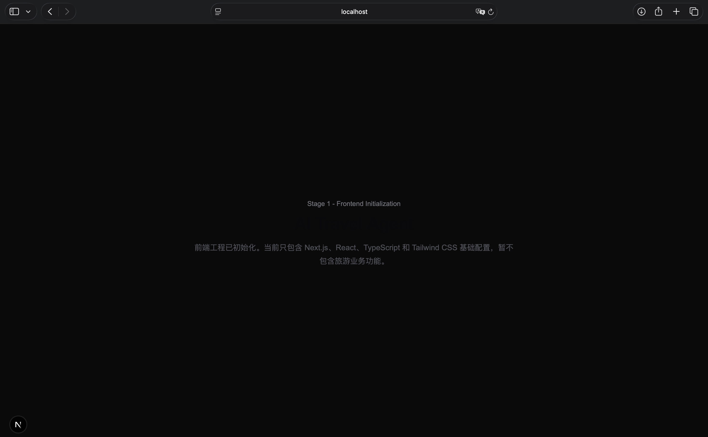
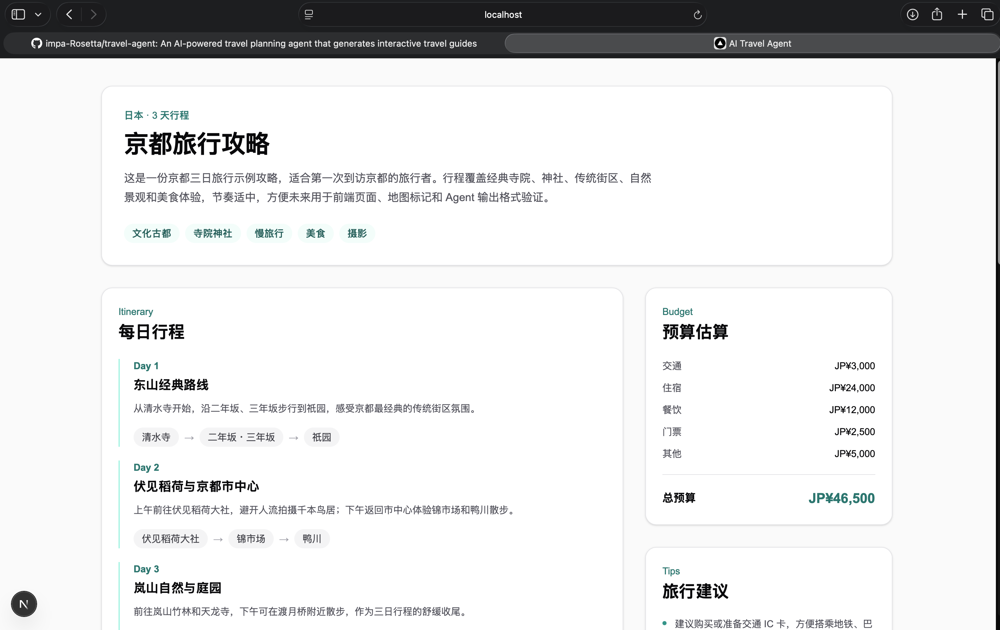
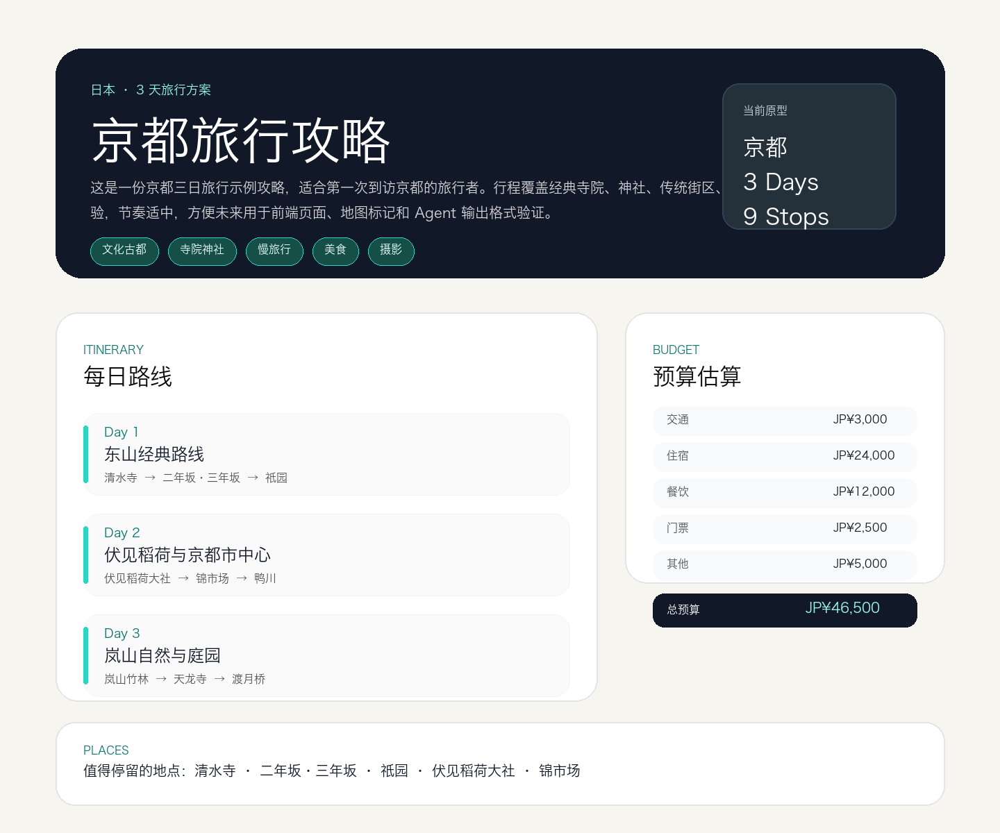

# 开发日志

## Day 1

## 日期：

2026-07-10

## 今日目标：

初始化前端工程。

## 完成内容：

- 创建 Next.js 前端项目
- 配置 TypeScript
- 配置 Tailwind CSS
- 完成实机运行测试并记录页面截图

## 新增文件：

- frontend/

## 学习知识：

- Next.js
- React
- TypeScript
- 前后端分离

## 技术理解：

前端应该独立于 Agent 后端，因为它们承担的职责不同。

前端负责用户界面、交互体验和结果展示。用户输入旅行需求、查看旅游攻略、浏览每日行程、点击地图地标，这些都属于前端关注的问题。

Agent 后端负责需求理解、任务规划、工具调用、信息整理和结构化输出。它更关注数据如何被生成、处理和返回。

把前端和 Agent 后端分开，可以让前端先使用模拟数据开发页面，也可以让后端独立演进 Agent 工作流。未来二者通过 API 连接，数据从后端流向前端，前端负责把数据清晰地展示给用户。

## 实机测试结果：

本地运行前端开发服务器后，浏览器可以正常打开初始化页面。

测试页面显示当前阶段为 `Stage 1 - Frontend Initialization`，说明 Next.js 前端工程已经可以正常启动并渲染基础页面。



## 遇到问题：

- 首次运行 Next.js 初始化命令时，沙盒环境无法访问 npm registry。
- 首次运行 `npm run build` 时，Next.js 16 的 Turbopack 在沙盒内创建进程和绑定端口被系统拦截。
- npm 安装完成后提示依赖审计中存在 2 个中等级别问题，本次未使用可能破坏依赖版本的自动修复命令。

## 解决方案：

- 使用授权方式重新运行官方初始化命令，完成前端工程创建。
- 使用授权方式重新运行 `npm run build`，生产构建通过。
- 暂不运行 `npm audit fix --force`，后续可以单独安排依赖安全维护任务。

## Git Commit:

feat: initialize frontend application

## 明日计划：

创建旅游攻略数据模型。

## Day 2

## 日期：

2026-07-10

## 今日目标：

设计旅游攻略数据模型。

## 完成内容：

- 创建 TypeScript Interface
- 创建 Sample JSON
- 创建数据结构文档

## 新增文件：

- frontend/src/types/travel.ts
- frontend/src/data/sample-guide.json
- docs/DATA_SCHEMA.md

## 学习知识：

- Schema
- Interface
- Structured Output
- 数据驱动开发

## 技术理解：

Agent 应该输出结构化数据，而不是只输出一段自由文本。

自由文本适合人阅读，但不适合程序稳定处理。旅游攻略未来需要被前端拆分成页面标题、每日行程、景点卡片、地图坐标、预算信息和导出内容。如果 Agent 只输出 Markdown，前端很难稳定判断每一段文字的真实含义。

结构化数据可以让 Agent 的输出进入后续工程流程：Backend 可以校验 JSON 是否符合 Schema，Frontend 可以按字段渲染页面，地图可以读取经纬度生成 Marker，导出功能也可以复用同一份数据。

## 遇到问题：

无

## 解决方案：

无

## Git Commit:

feat: define travel guide data schema

## 下一阶段：

实现基于 Mock 数据的旅游攻略页面。

## Day 3

## 日期：

2026-07-10

## 今日目标：

实现旅游攻略展示页面。

## 完成内容：

- 创建 React 组件
- 使用 JSON 数据驱动页面
- 完成旅游攻略原型
- 使用本地开发服务器验证页面渲染

## 新增文件：

- frontend/src/components/travel/TravelHeader.tsx
- frontend/src/components/travel/DayTimeline.tsx
- frontend/src/components/travel/PlaceCard.tsx
- frontend/src/components/travel/BudgetCard.tsx
- frontend/src/components/travel/TravelTips.tsx

## 修改文件：

- frontend/src/app/page.tsx
- DEVELOPMENT_LOG.md
- LEARNING_NOTES.md

## 学习知识：

- React Component
- Props
- 数据驱动 UI
- 组件拆分

## 技术理解：

未来 Agent 只需要生成符合 `TravelGuide` 结构的 JSON，前端就可以自动展示页面。

原因是页面组件并不关心数据来自哪里，只关心收到的数据结构是否稳定。`page.tsx` 读取 `sample-guide.json` 后，把目的地信息传给 `TravelHeader`，把每日行程传给 `DayTimeline`，把景点传给 `PlaceCard`，把预算传给 `BudgetCard`，把建议传给 `TravelTips`。

当未来接入 Agent 后，只要 Agent 输出同样结构的 `TravelGuide JSON`，前端组件就可以复用，不需要为每个目的地重新写页面。

## 测试结果：

- `npm run lint` 通过。
- `npm run dev` 启动后，`localhost:3000` 可以展示京都标题、三天行程、景点卡片、预算估算和旅行建议。
- `npm run build` 在授权环境下通过，生产构建成功。

实机测试截图：



## 遇到问题：

- 首次在沙盒内运行 `npm run dev` 时，Next.js 无法绑定 `0.0.0.0:3000`，出现 `listen EPERM`。
- 首次在沙盒内运行 `npm run build` 时，Next.js 16 的 Turbopack 创建进程和绑定端口被拦截。

## 解决方案：

- 使用授权方式重新运行 `npm run dev`，开发服务器成功启动，并完成本地页面验证。
- 使用授权方式重新运行 `npm run build`，生产构建通过。

## Git Commit:

feat: build travel guide prototype page

## 下一阶段：

完善页面交互。

## Day 4

## 日期：

2026-07-10

## 今日目标：

优化旅游攻略页面 UI。

## 完成内容：

- 优化页面布局
- 完善组件样式
- 增加响应式设计
- 生成 Day 4 UI 预览图

## 新增文件：

- docs/images/day-4-ui-preview.png

## 修改文件：

- frontend/src/app/page.tsx
- frontend/src/components/travel/TravelHeader.tsx
- frontend/src/components/travel/DayTimeline.tsx
- frontend/src/components/travel/PlaceCard.tsx
- frontend/src/components/travel/BudgetCard.tsx
- frontend/src/components/travel/TravelTips.tsx
- DEVELOPMENT_LOG.md
- LEARNING_NOTES.md

## 学习知识：

- Tailwind CSS
- Responsive Design
- UI 组件设计

## 技术理解：

好的 Agent 产品不仅需要生成正确内容，还需要优秀的展示层。

Agent 负责生成结构化数据，但用户真正接触到的是页面。旅游攻略包含目的地、行程、景点、预算和建议，如果展示层没有清晰的信息层级，用户会难以快速理解攻略价值。

本次优化通过 Hero 区域突出目的地，通过行程卡片强化阅读顺序，通过预算和建议侧栏提供辅助决策信息。这样未来 Agent 生成新的 `TravelGuide JSON` 后，前端可以用同一套组件把内容组织成更容易阅读的产品页面。

## 测试结果：

- `npm run lint` 通过。
- `npm run dev` 启动后，页面可以正常打开并展示 Day 4 优化后的 UI。
- `npm run build` 在授权环境下通过，生产构建成功。
- 示例数据检查通过：包含 3 天行程、9 个景点、预算和经纬度信息。

UI 预览图：



## 遇到问题：

- 沙盒内无法直接绑定端口运行 `npm run dev`，需要授权运行本地开发服务器。
- 沙盒内运行 `npm run build` 时，Next.js 16 的 Turbopack 创建进程和绑定端口被拦截。
- Playwright 和系统截图工具在当前环境中无法完成真实浏览器截图。

## 解决方案：

- 使用授权方式运行 `npm run dev` 验证页面。
- 使用授权方式运行 `npm run build` 验证生产构建。
- 使用当前 TravelGuide 数据生成 `docs/images/day-4-ui-preview.png`，作为 Day 4 UI 预览记录。

## Git Commit:

feat: improve travel guide user interface

## 下一阶段：

加入地图可视化。

## Day 5

## 日期：

2026-07-10

## 今日目标：

实现旅行需求输入原型。

## 完成内容：

- 创建 TravelRequest 数据模型
- 创建输入表单
- 模拟 Agent 生成流程
- 使用 React State 管理用户输入和页面状态

## 新增文件：

- frontend/src/types/request.ts
- frontend/src/components/travel/TravelRequestForm.tsx
- frontend/src/mock/generate-guide.ts

## 修改文件：

- frontend/src/app/page.tsx
- DEVELOPMENT_LOG.md
- LEARNING_NOTES.md

## 学习知识：

- React State
- 用户输入管理
- 前后端交互思想

## 技术理解：

今天的 Mock Agent 是未来真实 Agent 的替代接口。

当前 `generateGuide` 函数接收 `TravelRequest`，返回本地 `sample-guide.json`，模拟“用户提交需求后生成攻略”的过程。它不调用后端、不调用大模型，也不实现真实 Agent。

这样做的意义是提前确定前端交互边界：页面只需要把用户输入整理成结构化 `TravelRequest`，再等待一个返回 `TravelGuide` 的生成函数。未来接入后端时，可以把本地 `generateGuide` 替换为 Backend API + Agent Workflow，而页面主流程不需要大改。

React 状态流：

```text
Input
↓
State
↓
Function
↓
Component Update
```

## 测试结果：

- `npm run lint` 通过。
- `npm run build` 在授权环境下通过，生产构建成功。
- `npm run dev` 启动后，页面可以展示旅行需求输入表单和等待生成状态。

## 遇到问题：

- 沙盒内运行 `npm run build` 时，Next.js 16 的 Turbopack 创建进程和绑定端口被拦截。
- 沙盒内直接运行 `npm run dev` 需要授权绑定本地端口。

## 解决方案：

- 使用授权方式运行 `npm run build` 验证生产构建。
- 使用授权方式运行 `npm run dev` 验证 Day 5 输入页面。

## Git Commit:

feat: add travel request input prototype

## 下一阶段：

开始准备 Backend 和 LLM 接口。

## Day 6

## 日期：

2026-07-11

## 目标：

初始化 Backend。

## 完成：

- 创建 FastAPI 项目
- 创建 API 接口
- 创建 Pydantic Schema
- 创建环境变量示例文件
- 完成本地接口测试

## 新增文件：

- backend/requirements.txt
- backend/.env.example
- backend/README.md
- backend/app/main.py
- backend/app/api/travel.py
- backend/app/schemas/travel.py
- backend/app/services/.gitkeep

## 学习：

- Backend
- FastAPI
- REST API
- Pydantic

## 技术理解：

Agent 应用需要 Backend，因为智能能力、密钥管理、请求校验、工具调用和工作流编排都不应该直接放在 Frontend。

Frontend 负责交互和展示。Backend 负责接收请求、校验数据、保护 API Key，并在未来调用 Agent Workflow。今天的 Backend 只接收旅行需求并返回确认信息，还没有接入 LLM，也没有实现真正 Agent。

当前架构：

```text
Frontend
↓
Backend
↓
Mock Service
```

未来架构：

```text
Frontend
↓
Backend
↓
Agent
↓
LLM
↓
Tools
```

## 测试结果：

- `python3 -m py_compile app/main.py app/api/travel.py app/schemas/travel.py` 通过。
- `GET /` 返回 `AI Travel Agent Backend Running`。
- `POST /api/travel/request` 可以接收旅行需求并返回成功响应。

## 遇到的问题：

- 沙盒内直接运行 `uvicorn app.main:app --reload` 时，本地端口监听被拦截。

## 解决方案：

- 使用授权方式运行 `uvicorn app.main:app --reload`，完成接口验证后停止服务。

## Git Commit:

feat: initialize backend api service

## 下一阶段：

Frontend 连接 Backend。

## 日期：

## 今日目标：

## 完成内容：

## 新增文件：

## 涉及技术：

## 技术理解：

## 遇到的问题：

## 解决方案：

## Git Commit:

## 明日计划：
