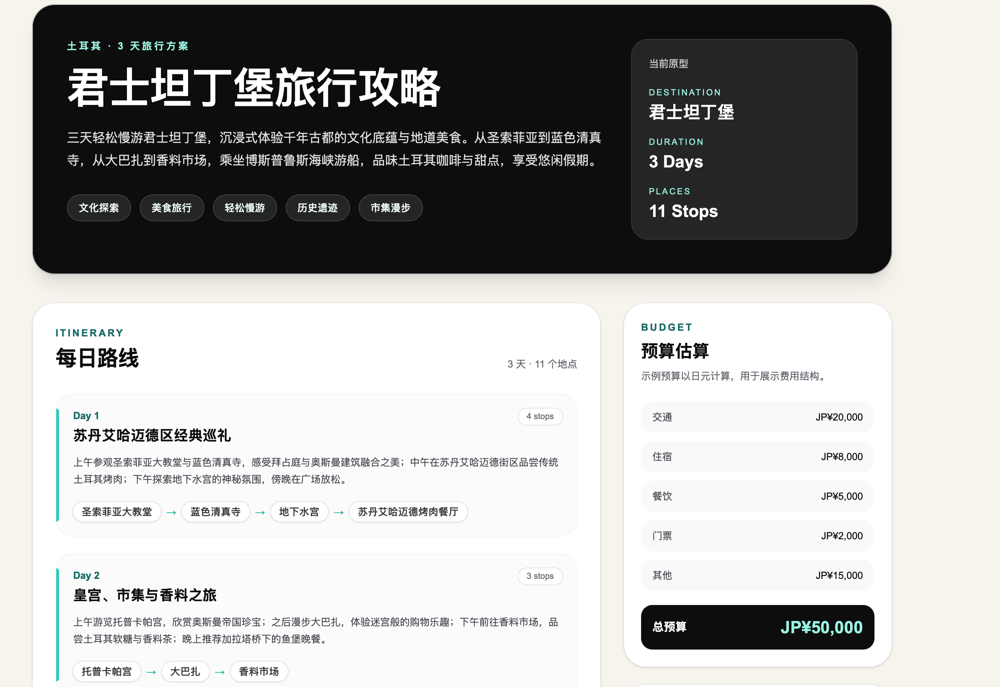
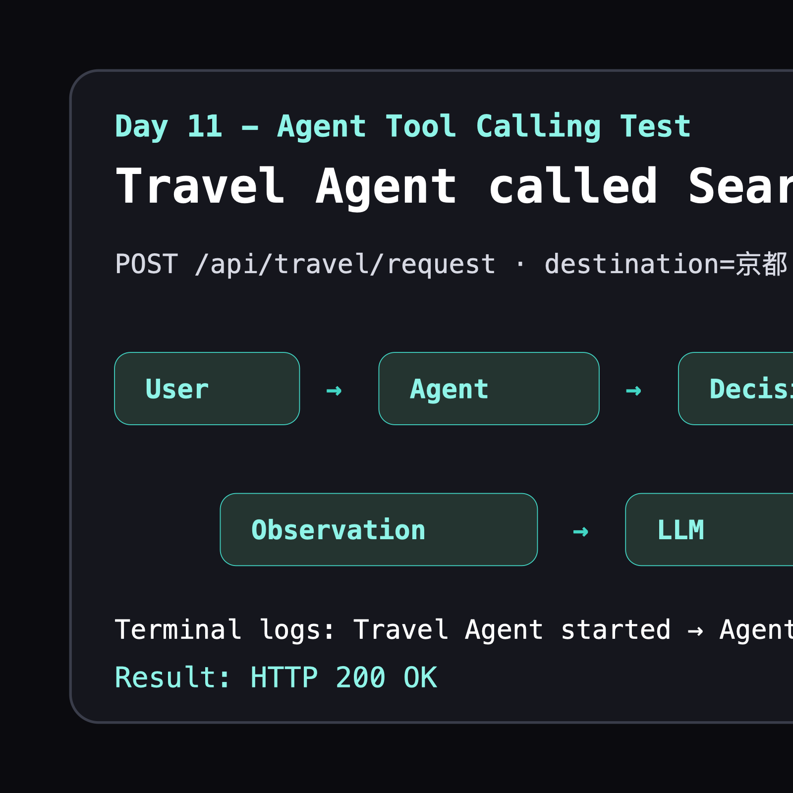

# AI Travel Agent

AI Travel Agent 是一个智能旅游规划 Agent 项目。用户输入旅行需求后，系统通过手写 Agent Workflow 调用工具、生成结构化攻略，并在网页中展示地图、行程、景点、预算、建议、下载和历史记录。

## 当前状态

Stage 6 - Complete AI Travel Agent Prototype

项目已经具备：

- Next.js 前端
- FastAPI Backend
- LLM Client
- Structured Output
- Tool Calling
- Travel Workflow
- Search Tool with Mock fallback
- 交互式地图 Marker
- 图片接口
- Markdown / HTML / PDF 下载
- SQLite 历史记录

## 架构

```text
User Request
↓
Frontend
↓
FastAPI
↓
Travel Workflow
↓
Planner
↓
Tool Layer
↓
Generator
↓
Validator
↓
TravelGuide
↓
Interactive Travel Page
```

详见 [ARCHITECTURE.md](./docs/ARCHITECTURE.md)。

## 技术栈

Frontend:

- Next.js
- React
- TypeScript
- Tailwind CSS

Backend:

- FastAPI
- Pydantic
- SQLite
- OpenAI Compatible SDK

AI:

- Prompt Engineering
- Structured Output
- Tool Calling
- 手写 Agent Workflow

## 本地运行

Backend:

```bash
cd backend
python3 -m venv .venv
source .venv/bin/activate
pip install -r requirements.txt
cp .env.example .env
uvicorn app.main:app --reload
```

Frontend:

```bash
cd frontend
npm install
cp .env.example .env.local
npm run dev
```

访问：

```text
http://localhost:3000
```

历史记录：

```text
http://localhost:3000/history
```

## 环境变量

Backend:

```env
LLM_API_KEY=
LLM_BASE_URL=https://api.deepseek.com
LLM_MODEL=deepseek-chat
```

Frontend:

```env
NEXT_PUBLIC_API_BASE_URL=http://127.0.0.1:8000
```

## 功能截图





## 文档

- [Roadmap](./ROADMAP.md)
- [Architecture](./docs/ARCHITECTURE.md)
- [Deployment](./docs/DEPLOYMENT.md)
- [Demo](./docs/DEMO.md)

## 未来规划

- 使用真实地图 SDK
- 接入真实图片生成 API
- 增加多目的地规划
- 增加用户账户和云端历史
- 优化部署和监控
